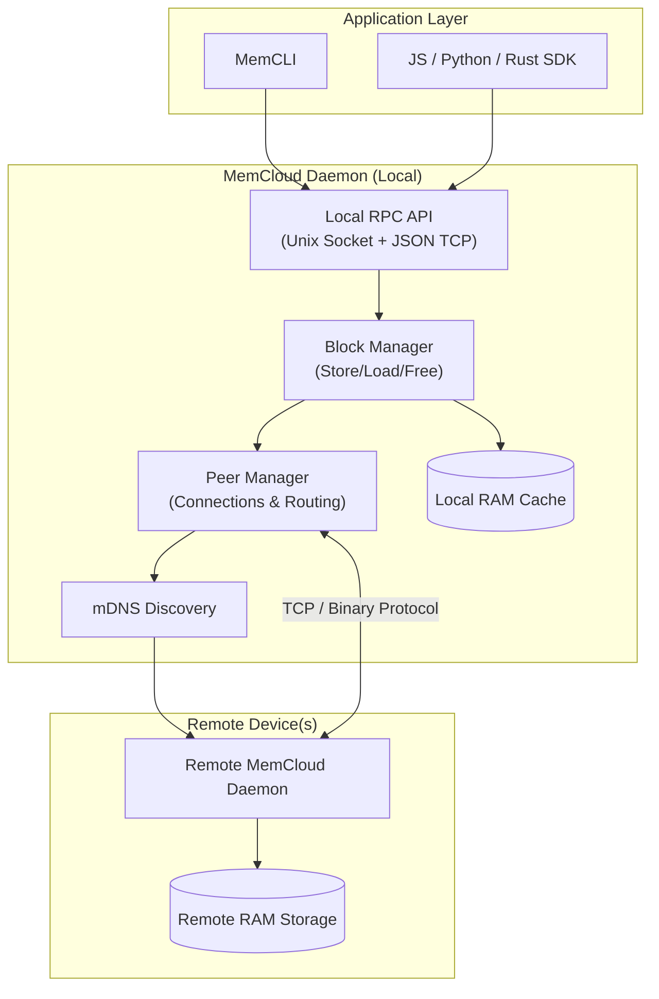
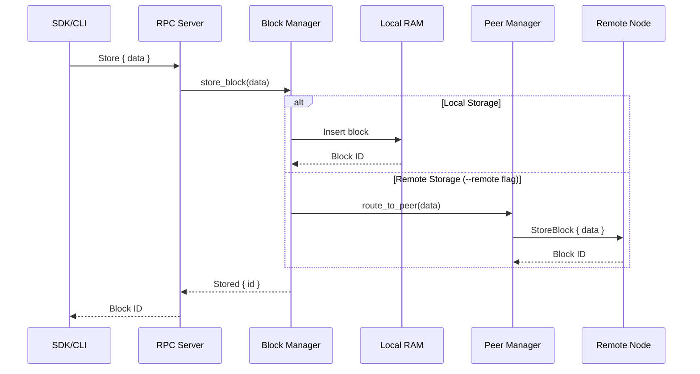
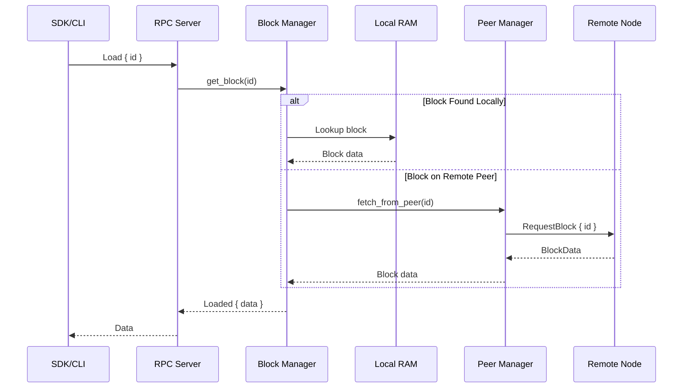
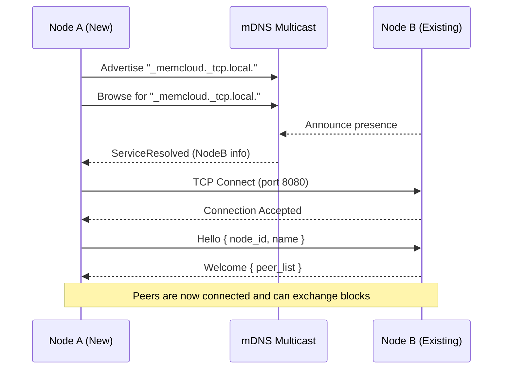

# MemCloud Architecture

This document describes the internal architecture of MemCloud, including data flows for core operations.

---

## System Overview



---

## Data Flow: STORE Operation

When a client stores data:



---

## Data Flow: LOAD Operation

When a client loads data:



---

## Peer Discovery Flow

MemCloud uses mDNS (Multicast DNS) for automatic peer discovery on the local network:



---

## Module Structure

```
memcloud/
├── memnode/                 # Core daemon
│   ├── src/
│   │   ├── main.rs          # Entry point, CLI args
│   │   ├── blocks/          # Block storage & management
│   │   ├── discovery/       # mDNS peer discovery
│   │   ├── net/             # TCP transport layer
│   │   ├── peers/           # Peer connection management
│   │   ├── rpc/             # Local RPC server (Unix socket + JSON TCP)
│   │   └── metadata/        # Block metadata & indexing
│   └── Cargo.toml
│
├── memsdk/                  # Rust SDK
│   ├── src/lib.rs           # Client API
│   └── Cargo.toml
│
├── memcli/                  # Command-line interface
│   ├── src/main.rs          # CLI commands (store, load, peers, node)
│   └── Cargo.toml
│
├── js-sdk/                  # TypeScript SDK (npm: memcloud)
│   ├── src/
│   │   ├── api.ts           # MemCloud class
│   │   └── socket.ts        # TCP/Unix socket transport
│   └── package.json
│
└── installers/              # Service files
    ├── macos/               # launchd plist
    └── linux/               # systemd service
```

---

## Wire Protocol

### Local RPC (JSON over TCP/Unix Socket)

All local communication uses length-prefixed JSON:

```
┌────────────────┬────────────────────────────┐
│ Length (4 bytes, big-endian) │ JSON Body  │
└────────────────┴────────────────────────────┘
```

**Example Commands:**
```json
// Store
{ "Store": { "data": [72, 101, 108, 108, 111] } }

// Load
{ "Load": { "id": 12345678 } }

// Set Key-Value
{ "Set": { "key": "my-key", "data": [1, 2, 3] } }

// Get Key-Value
{ "Get": { "key": "my-key" } }

// List Peers
"ListPeers"
```

### Peer-to-Peer Protocol (Binary)

Inter-node communication uses a binary protocol with `bincode` serialization for efficiency:

```rust
enum Message {
    Hello { node_id: Uuid, name: String },
    StoreBlock { id: u64, data: Vec<u8> },
    RequestBlock { id: u64 },
    BlockData { id: u64, data: Vec<u8> },
    SetKey { key: String, data: Vec<u8> },
    GetKey { key: String },
    KeyFound { key: String, data: Option<Vec<u8>> },
    Ping,
    Pong,
}
```

---

## Security Considerations

> ⚠️ **Current Status: Development/LAN Only**

MemCloud is designed for trusted local networks. Current security model:

- **No Authentication**: Any device on the LAN can connect
- **No Encryption**: Data is transmitted in plaintext
- **No Authorization**: All peers have equal access

**Future Roadmap:**
- [ ] TLS encryption for peer connections
- [ ] Pre-shared key authentication
- [ ] Access control lists (ACLs)
