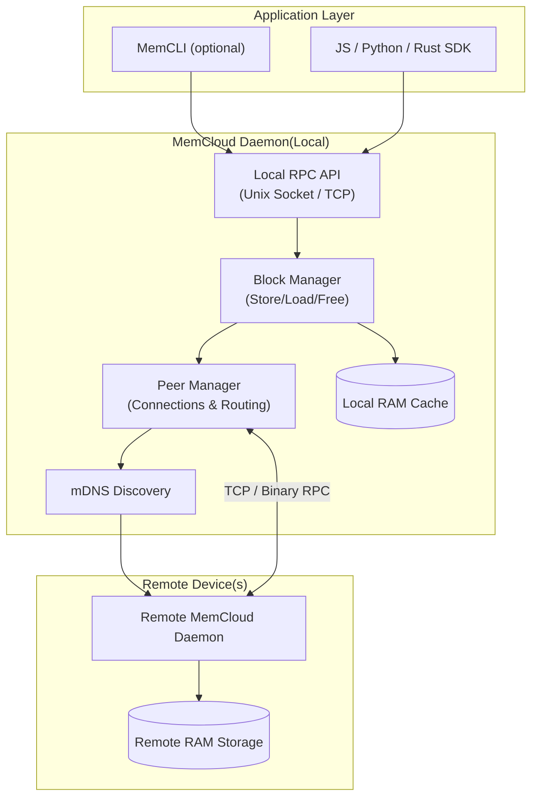

# MemCloud ☁️

**MemCloud** is a distributed in-memory data store written in Rust. It allows nodes (such as macOS and Linux machines) on a local network to pool their RAM, creating a shared, ephemeral storage cloud.

## 🏗️ Architecture

1.  **MemNode**: The core daemon running on each machine. It handles storage, networking, and discovery.
- `memsdk/`: Rust & C SDK Library.
- `memcli/`: The command-line client.
- `js-sdk/`: TypeScript SDK.
- `installers/`: Systemd/Launchd scripts.

## Features

- **Distributed Storage**: Seamlessly store and retrieve data blocks across peers.
- **Bi-Directional Sync**: Nodes can push data or fetch data from remote peers silently.
- **Named Peers**: Assign names to your nodes (e.g., "MacBook", "UbuntuBox") for easy targeting.
- **Key-Value Store**: Support for `set(key, value)` and `get(key)` in addition to raw block IDs.
- **JS SDK**: A TypeScript SDK for building Node.js applications on top of MemCloud.
- **CLI**: A powerful command-line interface for interaction and debugging.

## 🆚 Comparison

### Feature Matrix
| Feature | MemCloud | Redis | Memcached |
| :--- | :--- | :--- | :--- |
| **Core Value** | Pools Idle RAM on local machines. | Feature-rich in-memory database. | Simple key-value caching. |
| **Architecture** | **P2P** / Mesh (mDNS Discovery) | Client-Server | Client-Server |
| **Data Structures** | Strings (Key-Value) | Strings, Hashes, Lists, Sets, etc. | Strings |
| **Persistence** | None (Ephemeral Cache) | RDB/AOF (Optional) | None |
| **Ideal Use Case** | **Shared local dev/ML caching** and task distribution. | Session store, message broker, complex caching. | Simple, high-throughput string caching. |

### Performance Philosophy
**The Unique Advantage: Local P2P**
While Redis and Memcached shine as single-instance servers, MemCloud is designed for **distributed local caching**.

**Scenario**: 
-   **MemCloud**: Client A writes to Node B; Client B reads from Node B. (Simulating team task sharing).
-   **Advantage**: Latency is bound primarily by your fast local network (LAN) and the lightweight Rust daemon, utilizing idle resources across *all* connected machines rather than contending for a single server instance.

## Installation

### Prerequisites
- Node.js (for JS SDK)

### Quick Install (macOS & Linux)
To install MemCloud without cloning the repo, simply run:
```bash
curl -fsSL https://raw.githubusercontent.com/vibhanshu2001/memcloud/main/install.sh | sh
```
This will download the latest binary for your architecture and install it to `/usr/local/bin`.


### Build from Source
```bash
git clone https://github.com/vibhanshu2001/memcloud.git
cd memcloud
cargo build --release
```

Binaries will be available in `target/release/`:
* `memnode`: The daemon service.
* `memcli`: The command-line client.

## Usage

### 1. Start the Daemon (Easy Mode)
Use `memcli` to manage the node as a background service:

```bash
# Start node in background
memcli node start --name "MacBookPro" --port 8080
# 🚀 Starting MemCloud node 'MacBookPro' on port 8080...
# ✅ Node started successfully (PID: 12345)

# Check status
memcli node status
# ✅ MemCloud node is running (PID: 12345)

# Stop the node
memcli node stop
# 🛑 Stopping MemCloud node (PID: 12345)...
# ✅ Node stopped.
```

### 2. Start the Daemon (Manual Mode)
For debugging or foreground operation:
```bash
# On Machine A
memnode --name "NodeA" --port 8080

# On Machine B
memnode --name "NodeB" --port 8081
```

### 3. Connect Peers (One-time)
If mDNS discovery doesn't automatically find peers (e.g. different subnets), use manual connect:
```bash
# On NodeA, connect to NodeB
memcli connect <IP_OF_NODE_B>:8081
```

### 4. CLI Operations

**Store Data:**
```bash
# Store locally (or auto-distributed)
memcli store "Hello World"
# Output: Stored block ID: 123456789

# Store on specific peer
memcli store "Sensitive Data" --peer "NodeB"

# Set a Key-Value Pair
memcli set "app-config" "{\"theme\": \"dark\"}"
# Output: Set 'app-config' -> {"theme": "dark"} (Block ID: 556677)

# Get a Key-Value Pair
memcli get "app-config"
```

**Load Data:**
```bash
memcli load 123456789
```

**List Peers:**
```bash
memcli peers
```

**Show Stats:**
```bash
memcli stats
```

### 5. JS SDK Usage

Install the SDK:
```bash
npm install memcloud
```

Example usage:
```typescript
import { MemCloud } from 'memcloud';

const cloud = new MemCloud();

async function main() {
    await cloud.connect();

    // Store and retrieve data
    const handle = await cloud.store("My Data");
    console.log("Stored ID:", handle.id);

    const data = await cloud.load(handle.id);
    console.log("Data:", data.toString());

    // Key-Value Store
    await cloud.set("app-config", JSON.stringify({ theme: "dark" }));
    const config = await cloud.get("app-config");
    console.log("Config:", JSON.parse(config.toString()));

    // List peers
    const peers = await cloud.peers();
    console.log("Peers:", peers);

    cloud.close();
}

main();
```

See `js-sdk/README.md` for full API documentation.

## Distribution & Publishing

### Ubuntu/Debian (.deb)
We support generating `.deb` packages via `cargo-deb`:
1. Install tool: `cargo install cargo-deb`
2. Build Package:
   ```bash
   cargo deb -p memnode
   cargo deb -p memcli
   ```
3. Install:
   ```bash
   sudo apt-get install ./target/debian/memnode_*.deb ./target/debian/memcli_*.deb
   ```
   *Note: Installing `memnode` automatically sets up the systemd service.*


## License
MIT
